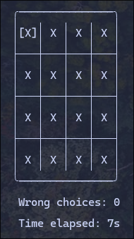

# A simple match-game in terminal!

So this is my first project in Golang; So the structure is not good enough.

But it works and I like it!

## How to run?
- Clone the project
- `go run .`
- You're good to go!

## How to play
- Press s to start the game
- Press h to go left
- Press j to go up
- Press k to go down
- Press l to go right
- Press q to exit
